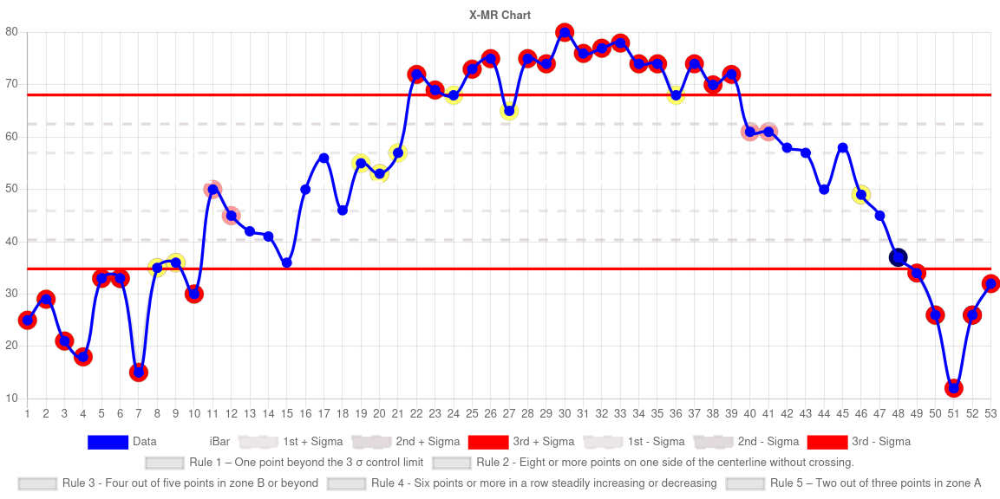

# Control Chart Analyzer

    

This tool automatically identifies out-of-control points in your processes. I built it over a few weeks during spare time with a personal challenge: **no LLMs or ChatGPT** allowed.

Honestly, relying on those tools felt like it would take away from the learning experience. So yeah, if you're looking at `home.js` and feel the urge to throw up, I get it. This is my full noob attempt at JavaScript. Also may have been a little tipsy during the creation of some of this code so again, I apologize.

I built this to better appreciate frameworks like React, Svelte, and TypeScript. By suffering through the raw reality of vanilla JavaScript, I’ve gained a deeper appreciation for what modern frameworks help solve.

This tool was originally created for the 2R2 community after visiting several bases where people were struggling with the basics of control charts. The goal was to help make those concepts easier to grasp.

If you're curious how it works, take a look at `home.js`. The only external library I used was `Chart.js`—because building a line graph from scratch sounded like a nightmare.

Everything is self-contained and runs completely offline.

If you found this helpful, want to say thanks, or are interested in collaborating on a future project, hit me up on Teams:

**nathaniel.pahlow@us.af.mil**

---

## Resources Used to Help Create the Logic

- [Rules for Properly Interpreting Control Charts](https://www.pharmaceuticalonline.com/doc/rules-for-properly-interpreting-control-charts-0001)
- [Unlock the Power of ImR (XmR) Control Charts – SPC with Excel](https://www.youtube.com/watch?app=desktop&v=cIP4PcGlZyM)
- [Control Chart Constants Table (PDF)](https://www.bessegato.com.br/UFJF/resources/table_of_control_chart_constants_old.pdf)

---

## Features

- **Automated data cleaning**  
  Invalid or unsupported values are filtered out and flagged with a warning.

- **Automated rule violation detection and visualization**  
  Easily identify when and where your process goes out of control.

- **Export to CSV or Excel**  
  Download processed data for documentation or reporting.

- **Automated test type selection**  
  The tool intelligently selects the appropriate control chart based on your data.

  - XMR/IMR Charts
  - Xbar-R Chart
  - Xbar-S Chart
  - C Chart
  - U Chart
  - NP Chart
  - P Chart

- **Completely offline**  
  Works 100% in your browser with no internet connection required.

- **Estimates time saved**  
  See how much time the tool saved you compared to manually checking for rule violations.

- **Countdown to Pahlow’s Retirment**  
  Curious when you can hire me on the outside? There’s a countdown for that too.

- **Handles large data sets**  
  Tested with up to 16,743 rows of data. Beyond that, your computer might start sweating.

---

## Setup Instructions

1. Go to the top right of this repository.
2. Click the **Code** button.
3. Select **Download ZIP**.
4. Right-click the downloaded ZIP file and extract it to a folder where you want to store the tool.
5. Open `home.html` by double-clicking it.
6. Paste your data directly from Excel into the webpage.
7. Select your data’s parameters.
8. Review the results.

---

Feel free to buy me a coffee if you'd like!

Enjoy!
